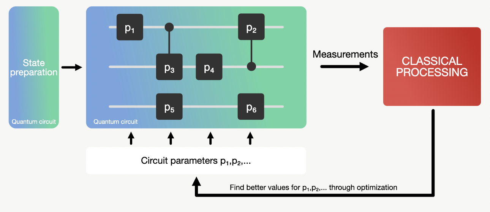

# Digital-analog Variational Quantum Eigensolver

*A challenge provided by IQM Quantum Computers*

This repository contains description and examples for the DAQC VQE challenge for the Womanium Hackathon 2022.

## Summary

This task is to develop a new VQE ansatz based on the digital-analog quantum computing (DAQC) framework. The ansatz will combine analog evolution of the processor hamiltonian with single qubit gates placed at the right time intervals. The model has potential to be “more hardware efficient” than typical hardware efficient ansätze.

## Motivation

An important task in Quantum Chemistry is to find the ground state energy of the system in question. This ground state energy actually corresponds to the minimal eigenvalue of the Hamiltonian of the system. The Variational Quantum Eigensolver algorithm (VQE) is one way to estimate this minimal eigenvalue that can actually be executed on a NISQ device.
However, in the NISQ era the noise introduced by gates is a problem. Digital-Analog Quantum Computing (DAQC) allows us to reduce the number of gates needed to perform quantum algorithms. It combines digital single qubit gates with analog multi-qubit blocks.
VQE is one of the algorithms, where DAQC has the potential to be “more hardware efficient” and thus allow for better ground state energy estimation than purely digital quantum computing in the NISQ era.

## Technical description

The VQE estimates the minimal eigenvalue $λ_{min}$ of a given (Hermitian) matrix $H$ by giving an upper boundary $\lambda_\Theta$ with $\lambda_{min} \leq \lambda_{\Theta}$. The corresponding eigenstate is noted as $\ket{ψ_{min}}$.

In order to find a good upper boundary, VQE uses a parametrized circuit U with parameters $θ=(p_1,p_2,…)$ (referred to as $U(θ)$). The idea is that the algorithm learns the best parameters to prepare the eigenstate $\ket{ψ(θ)}$ that belongs to the upper bound $λ_θ$. For this an ansatz is chosen. Ansätze (plural for ansatz) describe how sequences of gates are applied to qubits.

This circuit $U$ is then applied to some prepared state $\ket{ψ}$ (can be $\ket{0..0} though). This leaves us with the trial state:

$$U(θ)|ψ⟩=|ψ(θ)⟩$$

From this state, $λ_θ$ can be retrieved as the expectation value of:
$$⟨ψ(θ)|H|ψ(θ)⟩=λ_θ$$  

In the beginning this expectation value will be way off. But we can now use classical postprocessing to minimize the expectation value by iteratively finding better parameters $θ=(p_1,p_2,…)$.



For quantum chemistry, you can now do the following: 
1. Get the molecule’s Hamiltonian. Let’s assume it has the terms $Z_1$, $Z_1 Z_2$, $X_1 X_2 Y_1 Y_2$, 
2. Prepare the trial state $|ψ(θ)⟩$ by your ansatz, 
3. Measure the expectation value of the terms $Z_1$, $Z_1 Z_2$, $X_1 X_2 Y_1 Y_2$ for that trial state. With many measurements of these three quantities, you construct the total expectation value of the molecule's Hamiltonian and keep optimizing it classically.


Normally, VQE uses digital quantum gates. However, the multi-qubit gates involved in a VQE ansatz can be switched to analog mutli-qubit blocks.  

The challenge is to combine both approaches and create a VQE implementation that uses analog multi-qubit blocks. This is a promising approach to utilize DAQC.

Start trying with a nearest-neighbors Ising Hamiltonian on a one-dimensional device (where all N qubits are lined up in a string like so: x—x—x—x):

$$H_{analog}= \sum_j^N{\overline{g}_{j,j+1}Z_j Z_{j+1}}$$

After this, your new version should be compared to a solely digital approach (one that uses just normal gates). Then you can really spice things up and see how things change. We have some recommendations below.

The project is judged according to the following metrics:

* Technical soundness: You will receive full points in this category if you have a working implementation for a DAQC VQE and if you have it applied to one example use-case (e.g. for a $H^2$ molecule ... (additional problems give extra points)) (40%).
* Analysis: You will receive full points in this category if you compared the DAQC approach to a solely digital quantum computing approach by answering at least 2 questions. Example questions can be: “How do different Hamiltonians affects the DAQC VQE?” How much faster/slower do we get in different configurations? How does it compare to digital quantum computing?) (20%).
* Explanation: You will receive full points if you are able to communicate your idea and analysis in an understandable way. This can be done via text in the Jupyter notebook, explanations in the code, and by establishing links to existing theory (20%).
Presentation: Part of the judgement is also how you present your result. The presentation should be engaging and insightful (20%).


## Jupyter Notebooks
We prepared/curated two notebooks that will help you grasp the concepts involved in this challenge description.
The first is an implementation of the Variational Quantum Eigensolver. In this notebook, we will use Qiskit to apply VQE to estimate the ground energy of the H^2 molecule.

[IQM-challenge-variational-quantum-eigensolver.pynb](IQM-challenge-variational-quantum-eigensolver.pynb)

The second notebook will show you how to build an analog multi-qubit block in Qiskit. This uses the HamiltonianGate class for the analog building blocks.
[IQM-challenge-DAQC example-qiskit.ipynb](IQM-challenge-variational-quantum-eigensolver.pynb)

## Ideas for experimentation
After you finished your first implementation of DAQC VQE, we encourage you to experiment with the concept and your code. Please find below some ideas:
* Instead of just a two-body Ising Hamiltonian you can also include three-body terms such as: $H_{analog} = \sum_j^N{\overline{g}_{j,j+1}Z_j Z_{j+1}} + \sum_j^N{\overline{g}_{j,j+1,j+2}Z_j Z_{j+1}}Z_{j+2}$
  As there are more entangling terms, this Hamiltonian may allow for more entanglement per layer of the ansatz. How does that affect the result, or the number of layers required?

* Imagine two different configurations of nearest-neighbors Hamiltonians. One of them is a 1D chain, and the other is a central architecture (star shape). Both have the same number of qubits and connections, but in different configurations. Which one performs better? Any hypothesis why?

```
1D chain 

x—x—x—x

star shape
    x
    |
 x–—x–—x
    |
    x
```

## Additional sources you can check out for different frameworks

* Qiskit example: https://qiskit.org/textbook/ch-applications/vqe-molecules.html
* Cirq example: https://quantumai.google/cirq/experiments/variational_algorithm
* Pennylane example: https://pennylane.ai/qml/demos/tutorial_vqe.html and some examples for ansätze https://pennylane.ai/qml/glossary/circuit_ansatz.html


## Licence

The first notebook `IQM-challenge-variational-quantum-eigensolver.pynb` is part of Qiskit and licensed under Apache Licence 2.0 by IBM. This version has been altered from [the original](https://github.com/Qiskit/qiskit-tutorials/blob/master/tutorials/algorithms/03_vqe_simulation_with_noise.ipynb) by adding a custom ansatz. You can find a copy of this LICENSE in the root folder of this repository or at [http://www.apache.org/licenses/LICENSE-2.0](http://www.apache.org/licenses/LICENSE-2.0).

The other code and the text is licenced under Apache Licence 2.0 by IQM Quantum Computers.
